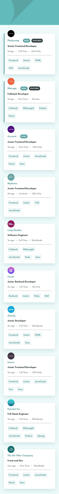
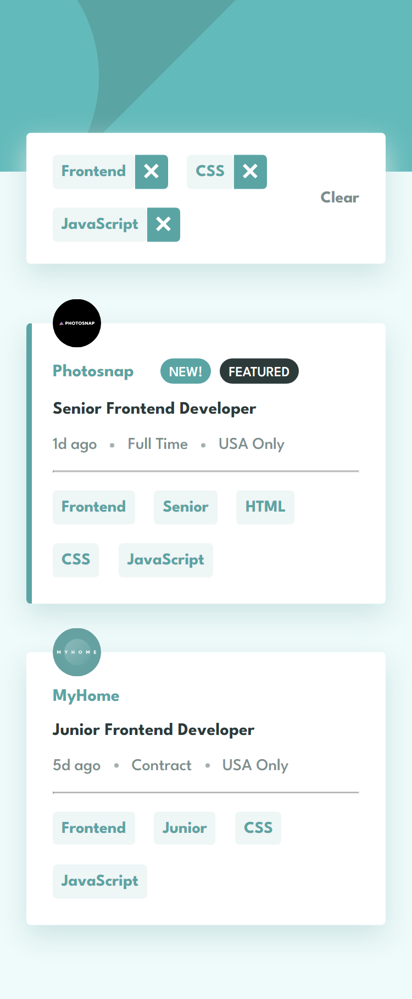
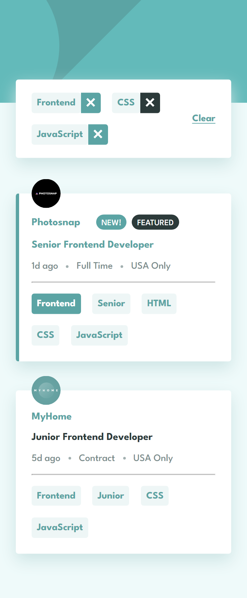
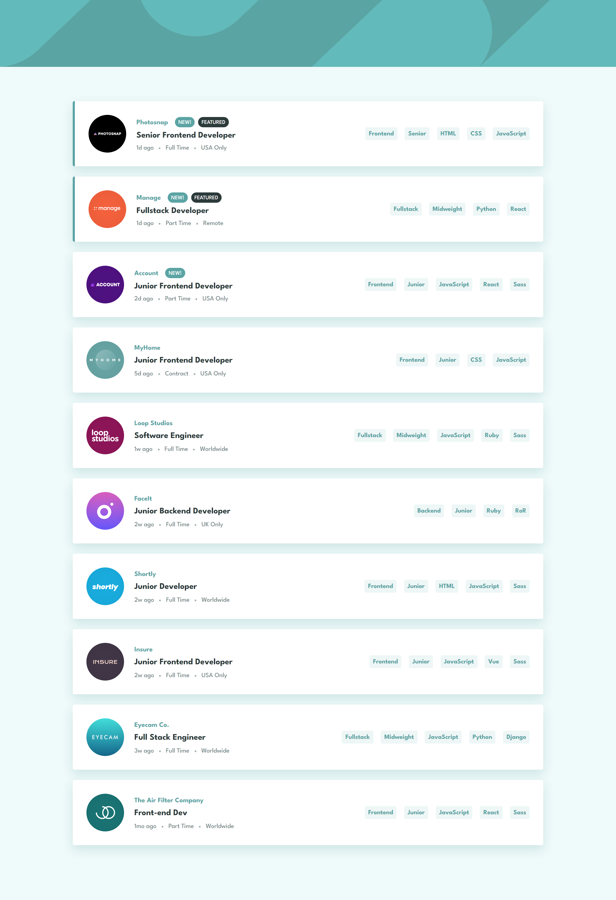
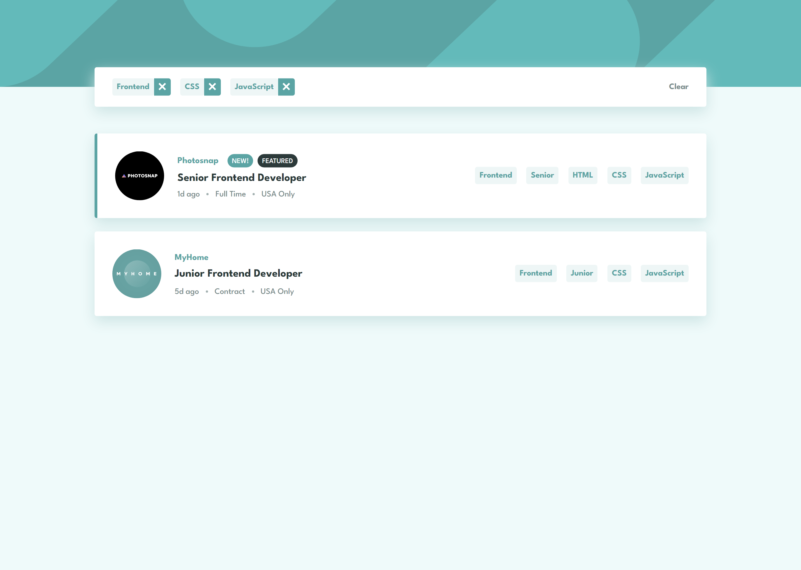
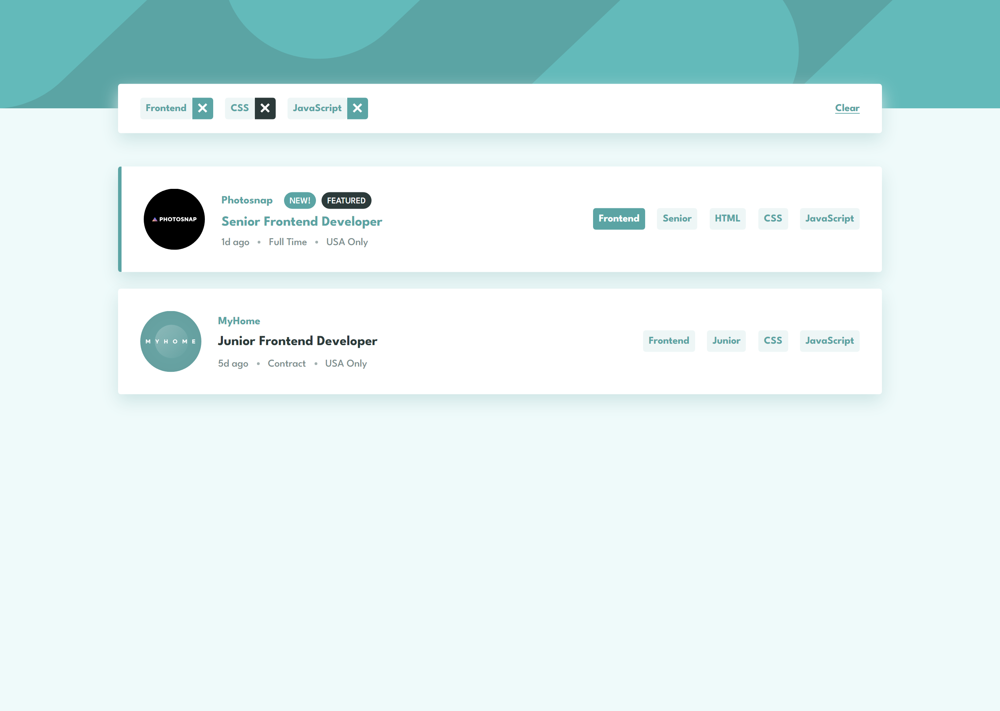

# Frontend Mentor - Job listings with filtering solution

This is a solution to the [Job listings with filtering challenge on Frontend Mentor](https://www.frontendmentor.io/challenges/job-listings-with-filtering-ivstIPCt). Frontend Mentor challenges help you improve your coding skills by building realistic projects.

## Table of contents

- [Overview](#overview)
  - [The challenge](#the-challenge)
  - [Screenshot](#screenshot)
  - [Links](#links)
- [My process](#my-process)
  - [Built with](#built-with)
  - [What I learned](#what-i-learned)
  - [Continued development](#continued-development)
- [Author](#author)

## Overview

This is the fifth and final challenge in the **Intro to JavaScript Frameworks Frontend Mentor Roadmap**. It consists of static job listing that you can filter by clicking the tags displayed in each job. that will filter the jobs to only the ones containing those tags.

### The challenge

Users should be able to:

- View the optimal layout for the site depending on their device's screen size **(DONE)**
- See hover states for all interactive elements on the page **(DONE)**
- Filter job listings based on the categories **(DONE)**

### Screenshot

#### Mobile

##### Mobile Initial View

##### Mobile Filter View

##### Mobile Active View

##### Desktop Initial View

##### Desktop Filter View

##### Desktop Active View

### Links

- Solution URL: [Add solution URL here](https://your-solution-url.com)
- Live Site URL: [Add live site URL here](https://your-live-site-url.com)

## My process

### Built with

- Semantic HTML5 markup
- CSS custom properties
- Flexbox
- CSS Grid
- Mobile-first workflow
- [React](https://reactjs.org/) - JS library
- [TypeScript](https://www.typescriptlang.org/) - Type Checking Language Built on top of Javascript.
- [Vite](https://vitejs.dev/) - Bundler and development environment for Frontend.

### What I learned

The goal of this project was to create a static job listings. the static part means there is no mechanism to create / modify jobs. the jobs list is stored in the data.json file. But it should be possible to filter which jobs to display based on the tablets the user clicked.

First of all I defined the components needed to represent the UI. the main ones are:

- **Job:** this is to represent each job listing on the page.
- **JobFilter**: this is to represent the filter box that shows up when filtering jobs.

The above main components are wrapped in a layout component called **Box**. and there are other low level components such as: **RemoveButton**, **ClearButton**, **Tablet** and **Badge** to represent smaller pieces in the UI.

There is only one piece of state. which is a string array which holds the tags the user has selected. we also used three handlers:

- **handleAddTag**: Adds a tag when the user clicks on a tablet. if the tag is not already in the list.
- **handleDeleteTag**: Remove a tag when the user clicks on the remove button of the specified tablet.
- **handleClearTag**: this sets the tags state array to an empty array. rendering the initial view of the app.

### Continued development

As I have completed the roadmap or at least it's free challenges since I don't have a pro subscription on Frontend Mentor.

I want to expand my knowledge and jump to other tools popular in the ecosystem. I'd like to research the most used libraries with React and take a look at the fullstack frameworks such as NextJS and Remix.

## Author

- Frontend Mentor - [@ilyesab](https://www.frontendmentor.io/profile/ilyesab)
